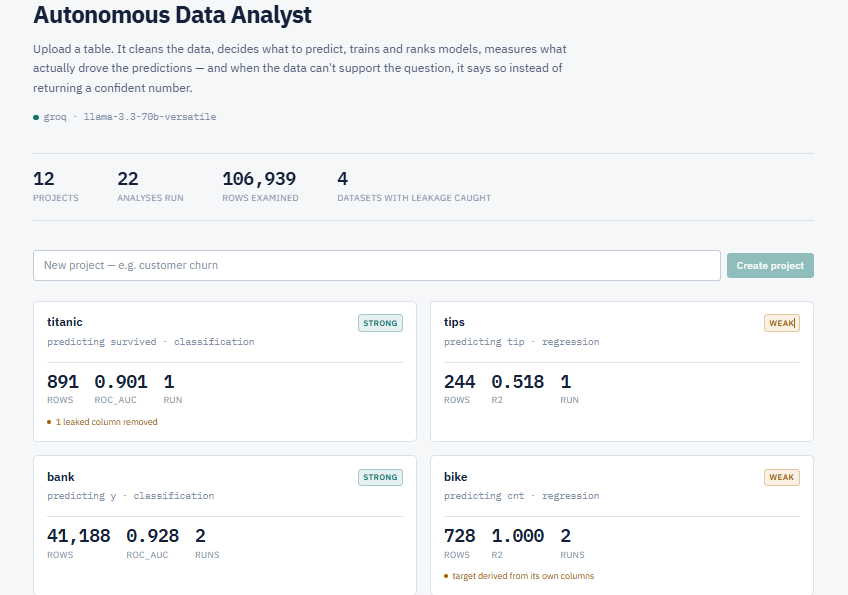
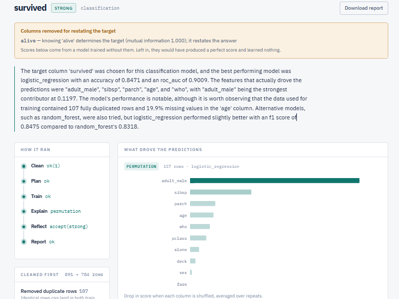
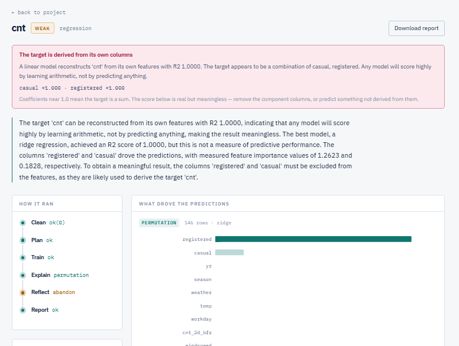
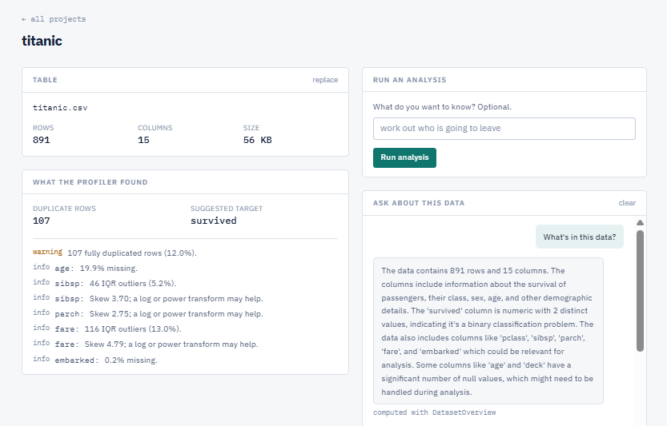

# Autonomous Data Analyst

**An agentic data analyst that tells you when your data can't answer your question.**


[**Watch a 90-second walkthrough**](https://youtu.be/26wGekv8rQ4)


Upload a table. It cleans the data, profiles it, decides what to predict, trains
and ranks models, measures what actually drove the predictions, judges its own
output against thresholds, and — when the data can't support the question —
says so instead of shipping a confident answer.

That last part is the point. Most AutoML demos always produce a result. This
one tells you your data isn't good enough, and shows you why.

---

## Tested against real data

Nine public datasets. Five classes of silent failure found and fixed — each
needing a different check, none catchable by unit tests alone:

| Finding | What exposed it |
|---|---|
| A column restating the target — Titanic's `alive`, producing a perfect and meaningless score | Per-feature mutual information |
| A target summing its own features — taxis, R² 0.997 from arithmetic | Linear reconstruction of the target |
| Missingness misattributed to a column's value — planets, where `mass` is 99.7% absent for one class and 7.8% for another | Explicit missingness indicators |
| Attribution lost in report formatting, reversing a fix one layer downstream | Reading the output |
| Cleaning assuming a comma delimiter, destroying semicolon-separated files before training saw them | Trying a dataset that wasn't comma-delimited |

Each is documented in [`docs/PHASE_NOTES.md`](docs/PHASE_NOTES.md) with the
measurement that prompted it. The habit that found all five: **treat a high
score as a hypothesis about the data, not a result.**

Titanic contains `survived` and `alive` — the same fact twice. Left alone, the
model scores a perfect 1.000 and has learned nothing. Here it is caught,
removed, and the honest result reported instead:



The bike sharing dataset is sharper still. `cnt` is literally `casual +
registered`, so a linear model reconstructs it exactly. The system reports
R² **1.0000** — and refuses to endorse it:



---

## What it does

```
CSV ──► Clean ──► Profile ──► Plan ──► Train ──► Explain ──► Reflect ──► Report
       (no LLM)  (no LLM)    (LLM)   (no LLM)   (no LLM)     (LLM)      (LLM)
                                        ▲                       │
                                        └───────── retry ───────┘
```

**Clean** — trims whitespace so `' Male'` and `'Male'` are one category,
converts placeholder text (`N/A`, `unknown`, `-`, `?`) to real nulls, drops
empty columns and exact duplicates. Duplicates matter: identical rows can land
in both train and test, quietly overstating every score. The original upload is
never modified.

**Profile** — deterministic statistics: semantic column types, null rates,
cardinality, IQR outliers, skew, correlations, quality warnings, and a ranked
shortlist of plausible targets. No model involved, so it's reproducible and
costs nothing.

**Plan** — an LLM reads the profile and chooses a target and task type. Its
choice is validated against the real column list; a hallucinated column falls
back to the deterministic shortlist rather than failing the run.

**Train** — scikit-learn pipelines with per-type imputation, scaling and
one-hot encoding. Identifier, constant and free-text columns are excluded with
reasons recorded. Before training, two leakage checks run: mutual information
catches a column that restates the target, and linear reconstruction catches a
target that sums its own features.

**Explain** — SHAP `TreeExplainer` for ensembles, permutation importance
otherwise, with the row count budgeted against model size so a large forest
can't block for minutes. One-hot columns fold back to their source column,
because a reader wants to know `contract` mattered, not
`cat__contract_Two year`. Missingness indicators deliberately stay separate.

**Reflect** — thresholds, not an LLM, decide whether a result is weak. Only
then is a model asked what to do about it, and it may drop inert features,
change target, or abandon. The retry loop is bounded three independent ways.

**Report** — a plain-language summary grounded in measured importances and
explicitly forbidden from speculating about causes, plus an executive PDF that
states the verdict before any number.

You can also **ask questions about the data**. The chat agent has seven
schema-validated tools and chooses which to call. There is deliberately no
"run this code" tool, and every answer shows which tools produced it.



A generated report is included at
[`docs/sample-report.pdf`](docs/sample-report.pdf) — the Titanic run, verdict
first.

---

## Run it

Requires Docker and a free API key from
[Google AI Studio](https://aistudio.google.com/apikey) or
[Groq](https://console.groq.com/keys). Neither needs a credit card.

```bash
git clone https://github.com/keyurc2332/Autonomous-Data-Analyst.git
cd Autonomous-Data-Analyst
cp .env.example .env          # paste your key into GOOGLE_API_KEY
docker compose up -d --build
docker compose exec api alembic upgrade head
```

Open **http://localhost:5173**. There's a deliberately messy CSV in
`sample_data/` to try it on.

```bash
docker compose exec api pytest        # 214 tests
curl localhost:8000/api/v1/llm/check  # confirms the model is reachable
```

---

## Design decisions

**Deterministic layers produce measurements; LLM layers produce judgements.**
Cleaning, profiling, training, explanation and quality assessment are pure
Python. The model decides *what* to predict, *whether* a result is trustworthy,
and *how* to explain it — nothing else. A hallucinated plan therefore produces
a validation error, not a corrupt pipeline.

**No test makes a network call.** All 214 pass with no API key set; every LLM
interaction is stubbed. Token spend at runtime is also flat regardless of
dataset size, because the expensive analysis is ordinary Python.

**Every model suggestion is validated before use.** Target columns are checked
against the real schema, proposed exclusions are filtered to columns that
exist, and a revision that would drop every remaining feature is refused. Each
guard has a test that feeds it a deliberately bad suggestion — including one
that hands the chat agent a call to `ExecutePython` with `rm -rf /` and asserts
the dispatcher refuses it.

**The retry loop is bounded three independent ways:** a hard round cap, a
required improvement margin on the *gating* metric, and detection of retries
that change nothing. An unbounded loop is the characteristic failure of agentic
systems, so it's the most heavily tested part of the codebase.

**Grounding beats prohibition.** Early versions invented causes — claiming
missing values had "hindered predictive ability" when the column was noise, or
that 482 rows was "too small" when the sample-size check had passed. Telling
the model not to speculate did not work. Handing it the specific facts it was
speculating about — measured importances, and the list of checks that *passed*
— did.

**No DataFrames in graph state.** LangGraph checkpoints state on every
transition. Datasets and fitted models live on disk; state carries IDs and
paths. The explain step reconstructs its train/test split from a fixed seed
rather than receiving it.

---

## Stack

| Layer | Choice |
|---|---|
| API | FastAPI, async SQLAlchemy 2.0, Alembic |
| Agents | LangGraph, LangSmith tracing |
| LLM | Gemini, Groq or local Ollama — swappable with one env var |
| ML | scikit-learn, SHAP |
| Reporting | ReportLab |
| Data | PostgreSQL 16, Redis 7 |
| UI | React 18, TypeScript, Tailwind v4, Recharts |
| Infra | Docker Compose, GitHub Actions |

Everything runs on free tiers.

---

## Layout

```
backend/app/
  core/       config, structured logging, LLM provider factory
  db/         models, async session
  services/   cleaning, profiling, storage, training, explain,
              quality, analysis, report, chat tools
  agents/     state, prompt compression, nodes, graph, chat agent
  api/        routes
frontend/src/
  api.ts        typed client mirroring the FastAPI models
  components/   RunTrace, Verdict, ImportanceChart, Chat
  pages/        Projects, ProjectDetail, RunDetail
sample_data/    a deliberately messy CSV
docs/           ARCHITECTURE.md and PHASE_NOTES.md
```

---

## Known limits

Stated plainly, because a limitation you find that I haven't named should make
you trust the rest less.

- **Analysis runs synchronously in the request.** Tables over 20,000 rows are
  sampled to keep runs interactive. A background worker is the right fix and
  isn't built.
- **Skewed targets aren't transformed.** Predicting a variable spanning five
  orders of magnitude (planets' `orbital_period`) gives a poor R². The profiler
  detects the skew; nothing acts on it.
- **Collinear features split importance unpredictably.** On diamonds, `y`
  outranked `carat` and `x` was reported as inert though all three measure size.
  On Titanic, `sex` looks unimportant because `adult_male` already encodes it.
  The profiler detects the collinearity; the explanation doesn't group by it.
- **Datetime columns are dropped rather than engineered.**
- **Reflection can exclude most features**, leaving a near-degenerate model. It
  refuses to exclude *all* of them; that's the only guard.
- **No authentication.** `api/deps.get_current_user` is the seam where it lands,
  and it refuses to serve if `ENVIRONMENT=production`.
- **Temporal leakage can't be detected.** A feature recorded *after* the
  outcome — bank marketing's `duration`, known only once a call has ended — is
  statistically indistinguishable from a good predictor. The system surfaces
  dominant features so a human can recognise it.
- **Graph checkpointing is in-memory**, so an interrupted run can't resume.

---

## Notes

[`docs/ARCHITECTURE.md`](docs/ARCHITECTURE.md) covers the graph, the layer
boundaries and the failure policy per node.

[`docs/PHASE_NOTES.md`](docs/PHASE_NOTES.md) records the reasoning behind each
decision and the bugs that shaped it — including the async lazy-load that only
appeared through the HTTP layer, the pandas 3.0 dtype change that made cleaning
silently do nothing, the SHAP call that would have run for fifteen minutes and
taken the whole API offline with it, and the gate metric that disagreed with
the stop condition for two full rounds before anyone noticed.
