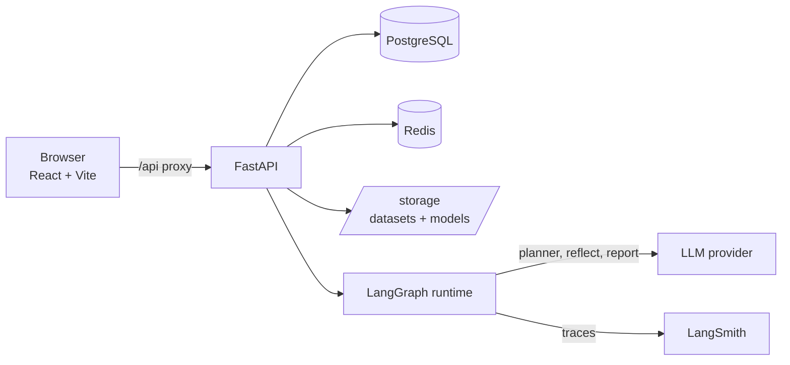
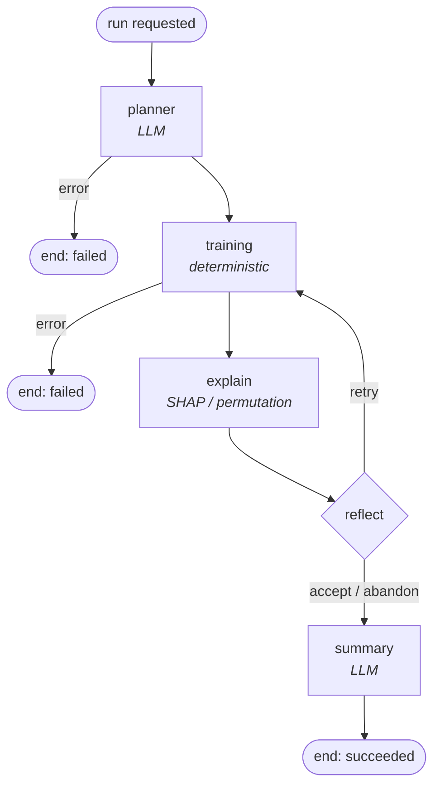

# Architecture

## Request path

## The analysis graph

Three LLM calls at most per round; training and explanation are pure Python.

## Where the boundaries are

| Layer | LLM? | Why |
|---|---|---|
| `services/profiling` | no | Ground truth. Same CSV, same profile, always. |
| `services/training` | no | A hallucinated plan must not reach a pipeline. |
| `services/explain` | no | Importances are measured, not narrated. |
| `services/quality` | no | "Is this weak?" is a threshold question. |
| `agents/planner` | yes | Choosing a target needs judgement. |
| `agents/reflection` | yes | *What to do* about a weak result needs judgement. |
| `agents/summary` | yes | Prose for a human reader. |

## Retry loop termination

Any one of these ends it:

1. **Round cap** — `MAX_REFLECTION_ROUNDS = 2`, so three attempts maximum.
2. **Improvement margin** — a retry must beat the incumbent by 0.02 on the
   *gate* metric (ROC-AUC for classification, R² for regression). Without a
   margin the loop churns on noise.
3. **No-op detection** — a revision that changes nothing becomes an accept,
   because re-running it would score identically forever.

Plus guards that strip unknown column names and refuse to exclude every
remaining feature.

## Failure policy per node

| Node fails | Behaviour |
|---|---|
| planner | Fall back to the deterministic top target candidate; continue. |
| training | End the run. There is nothing to explain or summarise. |
| explain | Continue without importances; metrics still stand. |
| reflect | Accept the current result and report it. |
| summary | Synthesise text from the metrics and succeed anyway. |

Only a training failure is fatal, because only training produces the thing the
run exists to deliver.

## Data flow constraints

- Datasets are stored on disk, referenced by `Dataset.storage_path`. Contents
  never enter Postgres and never enter graph state.
- Fitted pipelines are persisted to `storage/models/{run_id}/` and referenced
  by path, populating `Experiment.artifact_path`.
- `prepare_split()` is seeded, so the explain step reconstructs the identical
  test set rather than carrying DataFrames through state.
- Every value written to a JSONB column passes through a coercion helper:
  numpy scalars are not JSON-serialisable, and `NaN`/`Inf` are rejected by
  Postgres outright.

## Run tree

`agent_runs.parent_run_id` is self-referential. A run owns one child row per
training round, so the stored history mirrors the graph's real execution
including retries.
